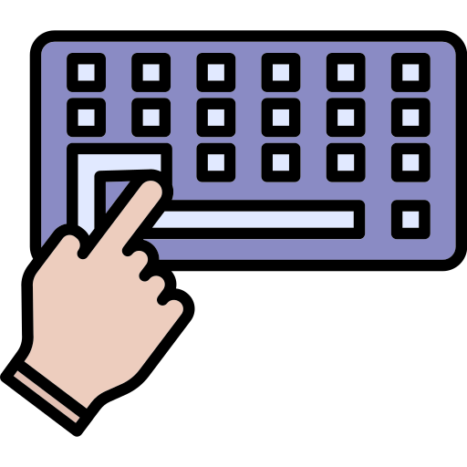
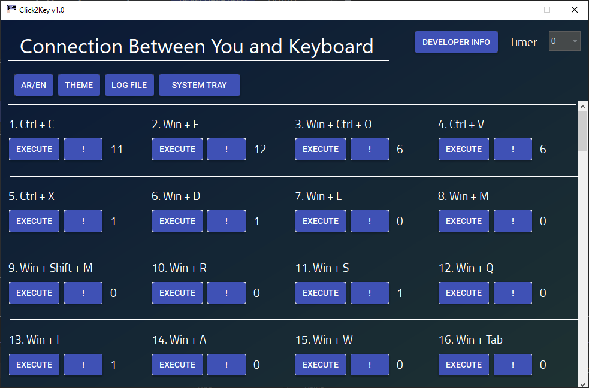

#  Click2Key

**Instant Windows shortcuts at your fingertips – with a built-in timer, system tray support, and full Arabic language support.**


---

## 🎮 Usage

1. Launch the application.
2. Choose the shortcut you want from the list.
3. (Optional) Select a delay from the dropdown (**0–5 seconds**).
4. Click the **Execute** button next to the shortcut.
5. If a delay is set, the button counts down — use that time to focus the target window.
6. The keyboard shortcut is sent to the system.

### System Tray

* Click the **System Tray** button to hide the window while keeping the application running.
* Double-click the tray icon to restore the window.
* Right-click the tray icon for:

  * Open
  * Turn Off/On System Tray
  * Exit

---

## 📸 Screenshots

### Main Application Window



---

## 🚀 Installation

### Option 1 – Download the Setup (Recommended)

Go to the Releases page and download **Click2Key-Setup.exe**.

```text
https://github.com/AliAlojeely/Click2Key/releases
```

Run the installer, choose a destination folder, and launch:

```text
Click2Key.exe
```

> .NET Framework 4.8 is required (already included in Windows 10 and Windows 11).

### Option 2 – Build from Source

```bash
git clone https://github.com/AliAlojeely/Click2Key.git
cd Click2Key

nuget restore Click2Key.sln

msbuild Click2Key.sln /p:Configuration=Release
```

Output:

```text
Click2Key\bin\Release\Click2Key.exe
```

---

## 📁 Repository Structure

```text
Click2Key/
├── Click2Key.sln
├── Click2Key/
│   ├── frmMain.cs
│   ├── frmAbout.cs
│   ├── ShortcutControl.cs
│   └── ...
├── ClickLogger.cs
├── ShortcutsRepository.cs
├── assets/
│   ├── key.png
│   └── main-app-photo.png
├── .github/
│   └── workflows/
│       └── release.yml
└── README.md
```

---

## 🔧 Built With

* **.NET Framework 4.8** — Windows Forms
* **ReaLTaiizor** — Modern UI controls and themed components
* **Win32 API (keybd_event)** — Keyboard shortcut simulation
* **GitHub Actions** — Automated build and release pipeline

---

## ✨ Features

* 100+ predefined Windows keyboard shortcuts
* Built-in execution timer (0–5 seconds)
* System tray support
* Arabic and English friendly interface
* Modern Windows Forms UI
* Lightweight and portable
* Open source

---

## 🛠️ Contributing

Pull requests are welcome.

For major changes, please open an issue first to discuss what you would like to change.

---

## 📄 License

This project is licensed under the MIT License.

See the **LICENSE** file for details.

---

## 👤 Author

**Ali Al-ojeely**

* GitHub: <https://github.com/AliAlojeely>
* Portfolio: <https://alial-ojeely.github.io>
* Email: [alialojeely@gmail.com](mailto:alialojeely@gmail.com)
